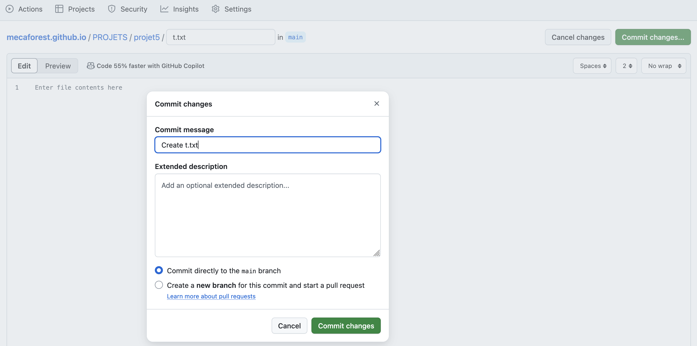
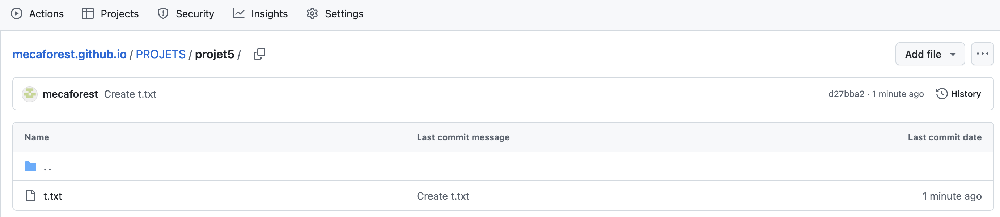
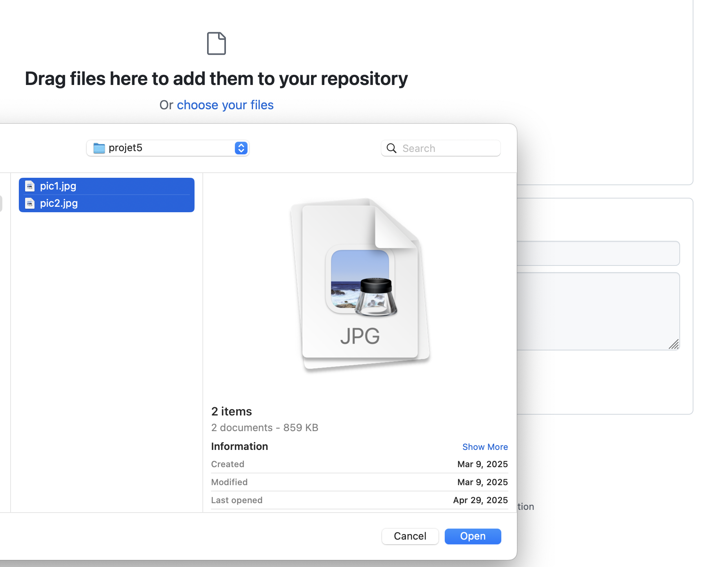
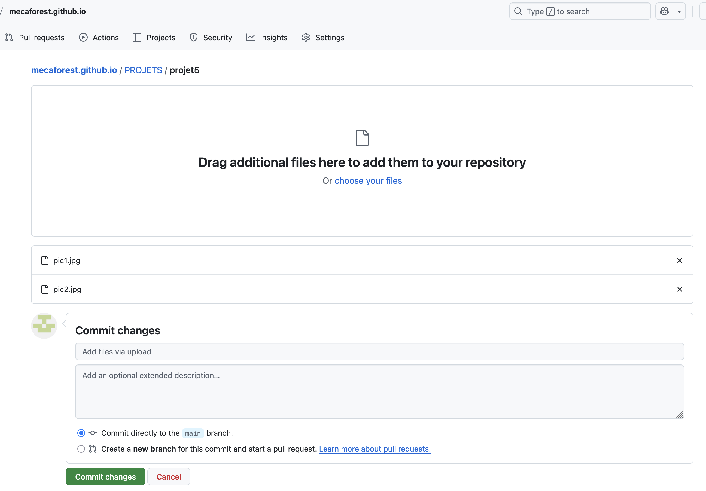
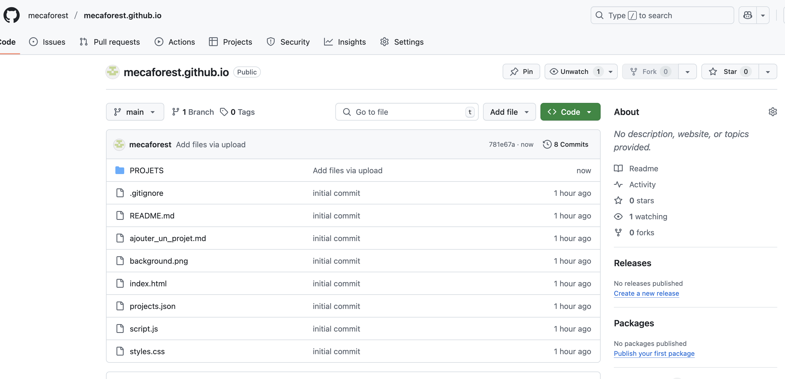
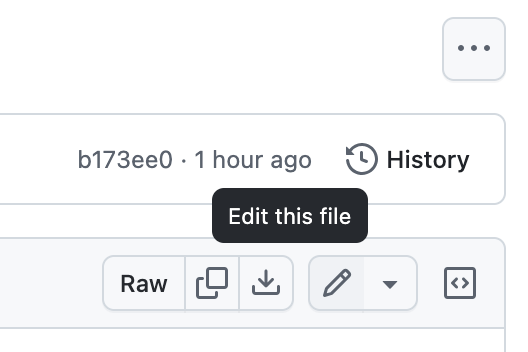
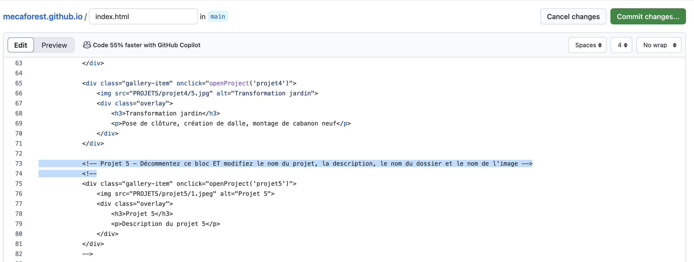
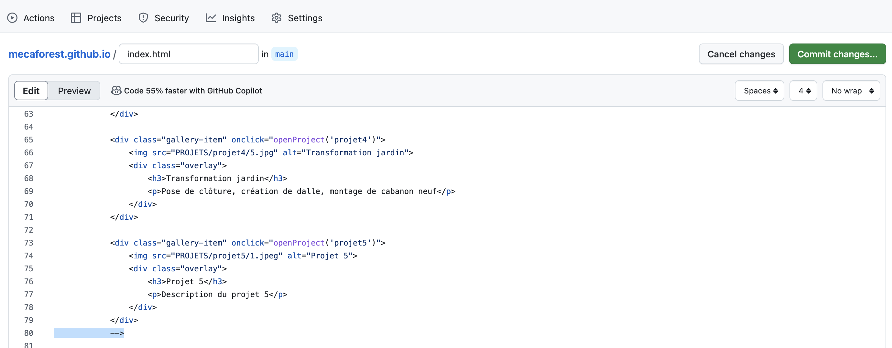
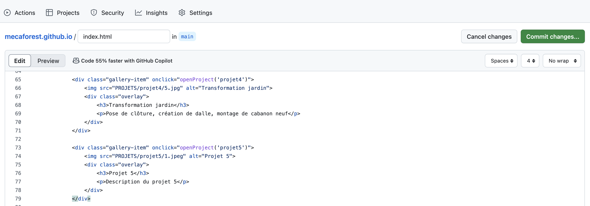

# Guide Simple pour Gérer les Projets
## Comment ajouter un projet sur votre site

### 🎯 Ce dont vous avez besoin
- Un ordinateur
- Vos photos dans un dossier (par exemple, créez un dossier "projet5") et mettez-y vos nouvelles photos
- Un compte GitHub (https://github.com/mecaforest)
- Une connexion internet

### 📸 Étape 1 : Préparer vos photos dans un dossier 
1. **Accédez à votre dossier** "projet5"
2. **Renommez vos photos** avec des nombres simples :
   - `1.jpg`
   - `2.jpg`
   - `3.jpg`
   - etc.
3. **Important** : Utilisez UNIQUEMENT le format `.jpg`
4. **Conseil** : Évitez les espaces ou caractères spéciaux dans les noms

### 🌐 Étape 2 : Création du dossier "projet5" sur GitHub
1. Allez sur https://github.com/mecaforest/mecaforest.github.io
2. Cliquez sur le dossier `PROJETS`
3. Cliquez sur "Add file" (en haut à droite) puis sélectionnez "Create new file"
4. Dans la zone qui apparaît, écrivez "projet5/t.txt"
5. Cliquez sur "Commit changes"
6. Ce que vous voyez doit ressembler à ça :

7. Cliquez sur "Commit changes"
8. Vous devriez voir ça :

9. Cela signifie que votre dossier a été créé et est prêt à recevoir les photos du projet

### 📸 Étape 3 : Ajout des photos du projet
1. En haut à droite de la page, cliquez de nouveau sur "Add file" puis cette fois-ci sur "Upload files"
2. Sélectionnez "Choose your files"
3. Une nouvelle fenêtre apparaît. Elle vous donne accès à votre ordinateur et vous permet de sélectionner les photos que vous souhaitez ajouter au projet.
4. Sélectionnez vos photos, comme ici :

5. Cliquez sur "Ouvrir"
6. Votre fenêtre doit ressembler à ça : 

7. Cliquez sur "Commit changes"
8. Après un court chargement, vous devriez arriver sur la page d'accueil de votre repo, comme ici :

9. Ça signifie que vos photos ont bien été chargées, il ne vous reste maintenant plus qu'à modifier un peu de code !

### 📝 Étape 4 : Modifier le fichier index.html
1. Sur la page principale du dépôt (https://github.com/mecaforest/mecaforest.github.io), cliquez sur `index.html`
2. Cliquez sur l'icône de crayon à droite de la page (Edit this file)

3. Trouvez la section des projets `<!-- Section Créations -->`
4. Trouvez le bloc commenté pour le prochain projet (ex : Projet 5) :
    ```html
    <!-- Projet 5 - Décommentez ce bloc ET modifiez le nom du projet, la description, le nom du dossier et le nom de l'image -->
    <!--
    <div class="gallery-item" onclick="openProject('projet5')">
        
        <div class="overlay">
            <h3>Projet 5</h3>
            <p>Description du projet 5</p>
        </div>
    </div>
    -->
    ```

5. **Décommentez** le bloc en supprimant les balises de commentaire :
   - Supprimez la ligne `<!-- Projet 5 - Décommentez ce bloc ET modifiez le nom du projet, la description, le nom du dossier et le nom de l'image -->` et aussi `<!--` comme ici :

   - Supprimez `-->` à la fin du bloc

   - Modifiez ensuite les informations du projet (titre, description, etc.)
   - Une fois terminé, votre code doit ressembler à ceci :
        ```html
        <div class="gallery-item" onclick="openProject('projet5')">
            
            <div class="overlay">
                <h3>Taille de Haies</h3>
                <p>Travaux de taille de haies réalisés en 2024</p>
            </div>
        </div>
        ```

6. En haut à droite de la page, cliquez sur "Commit changes" :

7. Une fenêtre apparaît, cliquez sur "Commit changes"
8. Terminé !

### 📝 Étape 5 : Modifier le fichier script.js
1. Sur la page principale du dépôt (https://github.com/mecaforest/mecaforest.github.io), cliquez sur `script.js`
2. Cliquez sur l'icône de crayon (Edit this file)
3. Trouvez la section `projectFiles` :

    ```js
    const projectFiles = {
        'projet1': ['1.jpg', '2.jpg'],
        'projet2': ['1.jpg', '2.jpg'],
        'projet3': ['1.jpg', '2.jpg', '3.jpg'],
        'projet4': ['1.jpg', '2.jpg', '3.jpg', '4.jpg', '5.jpg', '6.jpg', '7.jpg', '8.jpg'],
        // les fichiers de ton projet seront à rajouter ici
    };
    ```

4. Ajoutez les informations de votre projet, comme ici (cet exemple démontre l'ajout de 4 photos, si vous avez un nombre différent de photos, ajustez) :

    ```js
    const projectFiles = {
        'projet1': ['1.jpg', '2.jpg'],
        'projet2': ['1.jpg', '2.jpg'],
        'projet3': ['1.jpg', '2.jpg', '3.jpg'],
        'projet4': ['1.jpg', '2.jpg', '3.jpg', '4.jpg', '5.jpg', '6.jpg', '7.jpg', '8.jpg'],
        'projet5': ['1.jpg', '2.jpg', '3.jpg', '4.jpg'], // Ajoutez cette ligne pour le nouveau projet
        // ...
    };
    ```

5. En bas de la page :
   - Cliquez sur "Commit changes"
   - Une fenêtre apparaît, cliquez sur "Commit changes"
   - Terminé !

### ⚠️ Points importants à retenir
- Utilisez UNIQUEMENT des fichiers `.jpg`
- Nommez vos photos avec des nombres simples (1.jpg, 2.jpg, etc.)
- La photo numéro 1 sera toujours celle affichée en premier
- Ne modifiez pas les noms des dossiers existants
- Vérifiez que vos changements sont bien enregistrés (validés)

### 🆘 En cas de problème
Si quelque chose ne fonctionne pas :
1. Vérifiez que tous vos fichiers sont bien en `.jpg`
2. Vérifiez que vos photos sont bien numérotées
3. Vérifiez que vous êtes dans le bon dossier
4. Vérifiez que vous avez bien cliqué sur "Commit changes"
5. Attendez quelques minutes pour que les changements soient visibles sur le site

## Conseils
- Ajoutez un seul projet à la fois pour éviter les erreurs
- Vérifiez bien l'orthographe du nom du dossier et des images
- Utilisez des messages de validation clairs et descriptifs
- Attendez quelques minutes après chaque modification pour voir les changements sur le site

---
*Guide créé pour MécaForest - Version 4.2*